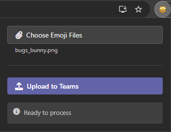
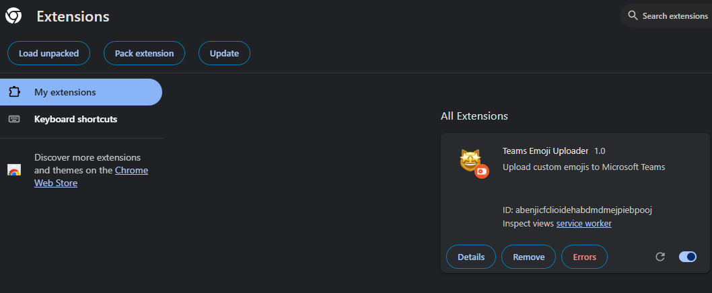

# 🎨 Teams Emoji Upload Extension

> Effortlessly bulk upload custom emojis to your Microsoft Teams organization with just a few clicks!



## ✨ Features

- Bulk upload multiple emoji files simultaneously
- Works via Teams in the browser

## 📋 Prerequisites

- Active Microsoft Teams tab in Chrome

## 🚀 Installation

### From Chrome Web Store

Download [Teams Emoji Uploader](https://chromewebstore.google.com/detail/teams-emoji-uploader/mlajagdepghhbclefnmcdnjfhfdmoofo) from the Chrome Web Store

### From Source

1. Clone this repository
2. Install dependencies and build:

```console
npm install
npm run build
npm test
```

3. Open Chrome and navigate to `chrome://extensions`
4. Enable "Developer Mode" in the top right
5. Click "Load Unpacked" and select this repository folder



> 💡 **Tip**: After making changes, rebuild the project and refresh the extension in Chrome

## 🛠️ Development

### Formatting Code

```console
npx prettier . --write
```

### Running Tests

```console
npm test
```

## 🤝 Contributing

Contributions are welcome! Please feel free to submit a Pull Request.

## 📄 License

[MIT License](LICENSE)
